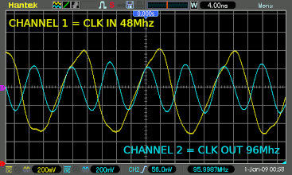

# Hardware Security Exploit Research - XBOX 360

I'm fairly well versed and have been involved in Original XBOX reverse engineering 20 years ago and have since not spent much time on the XBOX 360 beyond gaming and I have always been interrested in how exactly the XBOX 360 security was defeated and duplicate the results. 

So - here is a hopefully informative write up of my Journey to running unsigned code on a XBOX 360..   Buckle up.. its a long read :)

## Original XBOX (Released 2001)

The Original XBOX was released in 2001 and the security of that system was defeated by hardware reverse engineering fairly soon after launch and folks were able to run Linux on the system.  There were MANY mistakes made in the security for the original XBOX, the biggest of them were probably the basic oversights around implementation of very weak and outdated security hashing algorithms. The system saw 6 !hardware revisions through its short 4 year life span and every single one those included fixes to address security flaws and each of those "fixes" were in turn defeated within weeks of release. Today the original XBOX still is one of my favourite systems and I have quite a few of them squirreled away..

## XBOX 360 (Released 2005)

This cat and mouse game ended with the XBOX 360 being released in November 2005 and security on this system was priority No.1. The system is pretty solid and secure and I wont go through all the details, but suffice to say that every step of the way during the loading and execution of any code, there are hardware layers to make sure only Microsoft "signed code" can run. but.. Not everything is always perfect..

## XBOX 360 Security defeated - 2011

In late 2011, about six years after the launch of the XBOX 360, a couple of very smart hardware hackers (Gligli and Tiros) managed to completely defeat the XBOX 360 security by using a hardware "glitching" method and made the XBOX CPU essentially think the code it was executing is pure Microsoft provided "signed" code, when in fact it was tampered with.. i.e. You can run any code you want!! And thus the XBOX 360 RGH (Reset Glitch Hack) exploit was born!

## "Hardware Glitching"

Turns out, hardware is pretty susceptible to electrial interference and in specific, digital logic chips like CPU's dont like very noisy or unstable power, data or reset lines..  

So, you can alter the behaviour of a software system by manually injecting anomalies or errors onto the power, reset and data lines of underlying hardware. These anomalies makes the hardware execute the software instructions in unexpected ways and with a very cleverly crafted "anomaly" you can make hardware do things you want to software.. Like [SPOILER] skip verification checks!!

## How the XBOX 360 "Glitch" hack works

Super High level explanation of XBOX 360 boot process.
- The XBOX 360 starts up and starts loading sequences of Boot Loader (BL) code
- During this process, it supplies 8-bit "post codes" on an 8-bit bus present on the motherboard
- You can read these pins for post codes and each code represents a different step of the boot process.
- At post code 0xD8, BL RC4 decryption is done (RC4 Encrypted BL stored on flash chip)
- At post code 0xDA, BL SHA1 verification is done (compares hardware embedded signature to loaded code signature) 
- If signatures match, it is MS signed code and the system continues to start up
- If the loaded code signature does not match the hardware embedded signature, the system resets
- After a small number of resets and retry loops, the system halts

The "Glitch" 
- Glitching is done by injecting a very short 3-10 nanosecond pulse on CPU RESET line
- The Glitch is timed to happen EXACTLY when a "memory compare" function is executing
- This `memcmp` function is inside the SHA1 verification when comparing BL signatures
- The glitch will make `memcmp` return 0x00, meaning a perfect match, regardless of actual data compared
- If you can fake-out the CPU into thinking signatures match, you can run ANY code you want..

Step by step glitching an XBOX 360
- Create a NAND image with custom code and flash to onboard NAND chip
- Wait for post code 0xD8 (BL decryption)
- Issue a command on the I2C bus to slow down the CPU significantly
- Wait for post code 0xDA (BL verification)
- Wait EXACTLY until `memcmp` executes to compare signatures
- Send a 3-10ns pulse on CPU RESET line to glitch a 0x00 return from `memcmp`
- The system will "think" the signatures match and will continue to run un-trusted code
- Issue a command on the I2C bus to speed up the CPU back to normal
- Tadaa - you are now running fully un-trusted code!!
- The custom NAND image also contains a custom SMC (Systems Management Controller)
- If this custom SMC does not detect a success within a specific timeout, it resets and tries again.
- The custom SMC will also override the halt and continiously loop and reset until the glitch works.

You can read the full technical details and description from Gligli here:
https://github.com/gligli/tools/blob/master/reset_glitch_hack/reset_glitch_hack.txt

------------------
# Reverse Engineering the XBOX 360 RGH Exploit

## Learning by standing on the shoulders of giants

I have always been very intrigued at the inner workings of this incredible feat and wanted to duplicate this hardware glitch hack from scratch and really understand how it works. But, one of the barriers of entry was the timings of these attacks. You have to be EXTREMELY precise.. We are talking about TWO HUNDRED MILLIONTH of a second precise! Or more succinctly, you need te able to inject a single 3-10 nano second pulse at a VERY precise time after post code 0xDA shows up on the post bus. It has to align within 3-5 nanoseconds window of the `memcmp` function execution that verifies the signatures.

## Tools of the trade: XBOX 360

- Step 1 - Get a XBOX 360
- XBOX 360 acquired from Craigslist for $40!!!

## Tools of the trade: FPGA or CPLD

- Generating VERY precise timing and pulses, you need FPGA's or CPLD's
- Instead of re-inventing the wheel, as Gligli mentions, they used Xilinx CoolRunner II CPLD (xc2c64a)
- I found cheap xc2c64a boards on ebay that is actually specifically built for XBOX360 glitching
- This board has an onboard 48Mhz clock, but you can disable it and hook into the XBOX standbly Clock
- You can buy these from Amazon, Ebay or various online stores
- https://www.amazon.com/gp/product/B07KDCDN5H

# Tools of the trade: CPLD and NAND programmer

- You need to program the CPLD with glitch code
- And you need to flash a custom NAND image to the XBOX 360
- Turns out, there is a really handy tool that can do BOTH!
- I used a `J-R Programmer` that you can buy off E-Bay or Amazon 
- https://www.amazon.com/gp/product/B01MTUWLVJ

## Tools of the trade: Logic Analyzer

- You need to visualize data on the POST, RESET, DB2G3 and I2C lines
- I have a Saleae 8 channel 100Mhz, which turned out not to be fast enough
- I found a not too expensive 200Mhz Kingst LA2016 Logic Analyzer on Amazon
- There are better and more expensive, but this will do just fine.
- https://www.amazon.com/gp/product/B07D35FNYL

## Running existing RGH exploit

- I installed the "Matrix" board and was able to get the existing exploit running.
- This particular board uses an install called "Project Muffin" for XBOX 360 Slim systems
- "Project Muffin" does not connect to the I2C bus, but connects to the GPIO_0 pin on South Bridge marked "DB2G3" on the mainboard.
- The default custom NAND image just loads "XELL Reloaded", an open source boot loader
- After install, the Xell bootloader came up within 5-10 seconds.. the glitch works!!
- https://github.com/Free60Project/xell-reloaded

## Looking under the hood (Matrix board)

After install and sucessfull "Glitch", I started to look under the hood how this hack actually works and I connected the Logic Analyzer to the RESET (A), POST (B), CLK (C) and DB2G3 (E) pads of the Matrix board and additionally hooked it up to the XBOX 360's I2C bus SDA and SCL pins to monitor I2C traffic.

#### RESET (Matrix A >> XBOX RESET)
- The RESET pad is connected to XBOX CPU RESET pin, HIGH = Running, LOW = reset condition.
- When the system resets and starts boot the RESET pin goes HIGH and stays HIGH
- This is also the pin where the 5ns glitch pulse gets injected  by pulling it LOW
#### POST (Matrix B >> XBOX Post Bit 1)
- With every post message sent to the XBOX's 8-Bit post bus, the value gets incremented by 1
- The POST pad is only connected on a single bit of XBOX 8-Bit Post bus - Bit[1] 
- Connecting to Bit[1], means every SECOND post will toggle this pin HIGH/LOW
- This means you can count posts by counting every rising and falling edge of a single pin
- Should be easy to count posts to find post 0xD8 and 0xDA
#### CLK (Matrix C >> XBOX Standby CLK)
- I disabled the Matrix onboard oscillator by removing a zero ohm resistor.
- The CLK connects to the 48Mhz standby CLK on the XBOX 360
- The CLK signal is left unmodified, it clocks the CPLD and was ignored for my reversing purposes.
- Note - Newer revisions of XBOX 360 has no access to CLK and you must use Matrix oscillator
#### DB2G3 (Matrix E >> South Bridge GPIO_0 / DB2G3)
- This pad connects to a the GPIO_0 pin of the South Bridge marked "DB2G3" on XBOX 360 mainboard
- I was not sure exactly what this did in regards to this "Project Muffin" method (yet)
#### SDA & SCL ( XBOX I2C Bus SDA & SCL )
- I wanted to also monitor the I2C traffic to see what devices are on the bus
- The I2C was not connected to anything on the Matrix board at this time.

## Reading the Tea leaves..

I captured a few runs of the glitch and this is what I saw during the glitch 

#### RESET (PINK)
- The RESET pin toggles LOW/HIGH and after a while a VERY short LOW/HIGH pulse and then cycle repeats
- I suspect the first toggle is simply a system reset
- the super short less than 10ns pulse is highly likely to be the glitch pulse
- the subsequent RESET toggles are probably retry attempts when the glitch failed
#### POST (BLUE)
- There are 20 post bit 1 HIGH/LOW toggles that I counted during RESET LOW period 
- I refer to these HIGH/LOW rising and falling edges as "post counts", 1 count each per edge
- Then there are 10 post counts before the DB2G3 pin goes HIGH
- Post count 10 is likely post bus message 0xD8 (BL Decrypt) and DB2G3 HIGH is likely CPU slow down
- After 1 more post pin toggle at post count 11 there is the ~5ns pulse on RESET line
- It is highly likely that post count 11 is post message 0xDA (SHA signature verify)
- The RESET pulse right after post count 11 is likely the `memcmp` glitch 
- The DB2G3 line goes HIGH again right after the the glitch pulse, likely indicating CPU speed up
#### DB2G3 (ORANGE) (Marked as DEBUG in trace)
- The DB2G3 pin on the South Bridge has a single long HIGH/LOW period during a RESET cycle
- It is highly likely that this is what controls CPU slow down and speed up
- I disconnected this pin and the time between post count 10 and 11 was WAAAAAY less.. 
- This told me that DB2G3 HIGH at post count 10 is for sure CPU slow down and LOW is speed up at count 11
#### SDA & SCL (GREEN & YELLOW)
- The I2C bus has a bunch of traffic, but after a number of RESET cycle captures, I found a pattern!
- Right after the DB2G3 line goes HIGH, there is always a `0xCD,0x04,0x4E,0x08,0x80,0x03` message
- Right after the DB2G3 line goes LOW, there is always a  `0xCD,0x04,0x4E,0x80,0x0C,0x02` message
- These two messages are identical except for th last 3 bytes, so they must be related!
- more captures by disconnecting the DB2G3 pin had none of these messages
- Confirmed DB2G3 HIGH/LOW is for slowdown/speedup and it triggers these I2C messages
- So, instead of using the DB2G3 pin, injecting these messages directly on the I2C should have same effect

## Glitching the XBOX 360 and running unsigned code!!!

I ran a bunch of Logic Analyzer dumps, measured all the timings between events and was able to to piece together the EXACT timings and steps I needed to perform the XBOX 360 Reset Glitch Hack.
- STEP 1 - Wait for RESET to complete and start counting post Rising/Falling edges
- STEP 2 - At post count 10 - Issue a "slow down" I2C message `0xCD,0x04,0x4E,0x08,0x80,0x03`
- STEP 3 - At post count 11 - start a "Glitch Timer"
- STEP 4 - After EXACTLY 180,840 nano seconds, send a 10 nanosecond LOW/HIGH pulse on RESET (Glitch!)
- STEP 5 - Issue a "speed up" I2C message `0xCD,0x04,0x4E,0x80,0x0C,0x02` to restore CPU clock
- If RESET gets pulled LOW and there are post counts, this means the glitch failed and system reset
- If system reset, start over again from Step 1

I did not want to use the South Bridge GPIO_0 (DB2G3) pin, since I have heard rumours about repurposing the South Bridge output pin as a SMC input pin was not healthy for the South Bridge.. Jury is still out, but I wanted to use the tried and true Gligli method using just the I2C bus.

So after reading a book and few tutorials on Verilog, I downloaded the free Xilinx ISE 14.7 IDE and went about implementing the all the code in this repo to perform steps 1 through 5 and all the rest of the logic to auto restart and retry and additionally use I2C based slowdown instead of South Bridge GPIO_0 (DB2G3) "Muffin" style slowdown.

I have to say, getting everything to work and fit into a 64 cell CPLD, was REALLY tricky!! Everyone I spoke to told me that it can't be done..  Well.. I finally cracked it and it all fit and seemed to work as planned.

I played with the Glitch Timer values and I finally got it to glitch and XELL loaded up!!! HOLY SHIT, IT WORKS!!!! but it was VERY inconsistent.. I could only get it to sucessfully glitch like once or twice after many many many reset cycles..

Finally I reached out to some folks on Discord familiar with XBOX 360 RGH (Mena and Octal450) and I learnt that the XBOX 360's standby clock at 48Mhz is waay too slow for consistent glitches. You can process the clock on Dual Edge Triggering (DET) with a Xilinx Coolrunner CPLD, meaning you can process on both rising and falling edges of a clock and in theory the processing happens at 96Mhz, but still even working with ~10 nanosecond periods it seemed too slow.  I saw notes in existing exploit files that it was running at 192Mhz and getting 48Mhz to 192Mhz with this tiny CPLD seemed pretty darn impossible!

There are no built-in IP logic on CPLD's to perform frequency multiplication using Phased Lock Loops (PLL) or Digital Clock Managers (DCM's) or other features you typically get for free in FPGA's..  After some serious Google fu and head scratching, I found an archive on Xilinx Forums on a way to DOUBLE the frequency of a digital circuit by phase delaying the signal a little and then XOR'ing an inverse of the delayed signal with the original and boom! you can double the Frequency!

Super cool tecnique I found on Xiling Forums: https://forums.xilinx.com/t5/General-Technical-Discussion/the-implement-of-frequency-multiplier/m-p/199162/highlight/true#M9312

I implemented this Flip-Flop with clock XOR trick on the 48Mhz clock that should produce a 96Mhz clock and then did Dual Edge Triggering ontop of that to theoretically get to 192Mhz!  Now to test it out and check the output frequencies!

I hooked up my Oscilloscope to the board and after some tests involving basic frequency measurements, I confirmed the CPLD was doing exactly what the Xilinx forum suggested.. It delayed the input 48Mhz clock phase by a few degrees, then XOR'ed the Input 48Mhz and delayed 48Mhz clock signals to produce a DOUBLE frequency clock signal at 96Mhz - Then you can do Dual Edge Triggering to process signals at 192Mhz!!!!  Thats pretty crazy to process at 4x the input clock speed without any PLL's or DCM's!!!  

### Now I could process and produce signals on the CPLD in 5.208333 nanosecond periods - that is a pretty darn accurate clock !!

After these Changes and some more input from Octal450 on glitch timing fine tuning and a suggestion to delay the "slow down" message until 30-50ms after post count 10, I found the magic numbers..  and BOOM!!  I was able to glitch the XBOX 360 pretty much within 1-5 seconds EVERY single time!! using code I created entirely from a Logic Analyzer output !!!

This was a WILD ride! I learnt so much during the process about hardware glitching and how powerful of a tool such a teeny tiny little anomaly at the right time could be! 

I am still AMAZED at the people who researched this hack 10 years ago and found all the puzzle pieces to pull it off..  This is a very advanced hack and to get to to work so well and so consistently is pretty darn incredible.

#### Thanks Octal450 and Mena on Discord for your help and guidance, it certainly was a cool journey.

Feel free to ping me if anyone has any questions about the code or the process 

ENJOY!

Koos

